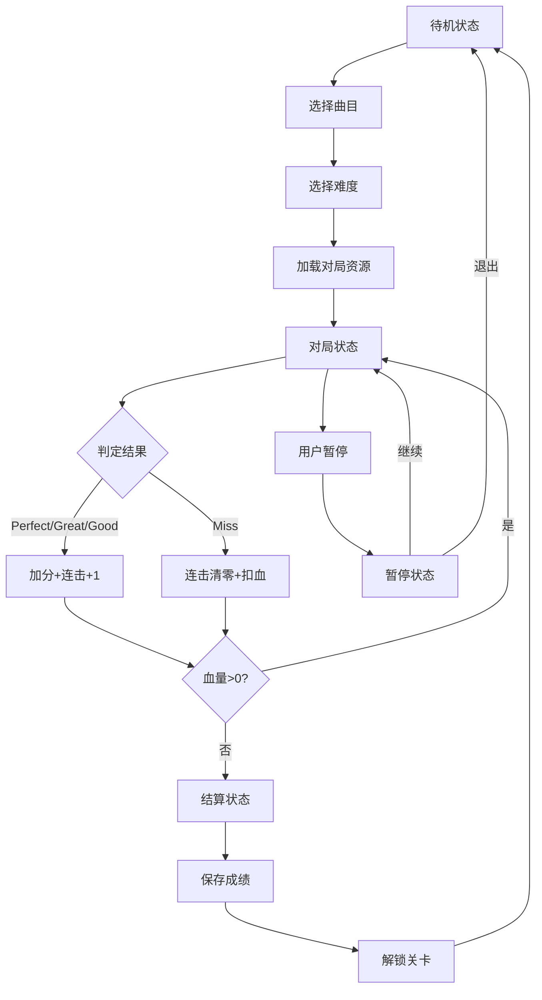

## 1. 产品概述

Rhythm Master 是一款前后端分离架构的音乐节奏类 H5 游戏，前端专注于画面渲染与触控交互（3654 端口），后端承载核心玩法逻辑（9654 端口）。玩家通过精准点击下落音符获得分数，体验从入门到高阶的多难度曲目挑战。

- 核心玩法：跟随音乐节拍点击对应轨道音符，追求完美判定与高连击
- 目标用户：音乐游戏爱好者、休闲玩家
- 产品价值：提供沉浸式节奏游戏体验，支持多难度梯度成长体系

## 2. 核心功能

### 2.1 用户角色
| 角色 | 注册方式 | 核心权限 |
|------|---------|----------|
| 玩家 | 本地存档自动注册 | 游戏对局、进度保存、分数记录、关卡解锁 |

### 2.2 功能模块
1. **主页**：曲目列表、关卡选择、难度切换、个人记录
2. **游戏对局页**：音符下落轨道、触控判定区、实时状态面板
3. **结算页面**：本局评分、分数统计、连击记录、评级展示
4. **设置页面**：音效控制、操作方式、游戏重启

### 2.3 页面详情
| 页面名称 | 模块名称 | 功能描述 |
|---------|---------|----------|
| 主页 | 曲目列表 | 展示已解锁曲目，显示难度星级、最高分数 |
| 主页 | 关卡选择 | 点击曲目进入难度选择，支持普通/高速模式 |
| 主页 | 进度展示 | 显示闯关进度、总星数、最高连击记录 |
| 游戏对局页 | 音符轨道 | 4条轨道，音符按节拍下落，支持变速/隐形特殊机制 |
| 游戏对局页 | 触控判定 | 4个判定按键，支持点击/触摸操作 |
| 游戏对局页 | 状态面板 | 实时显示连击数、总分、血量、当前评分等级 |
| 游戏对局页 | 暂停功能 | 支持暂停/继续，断线自动重连恢复对局 |
| 结算页面 | 成绩展示 | 显示总分、准确率、最大连击、评级（S/A/B/C/D） |
| 结算页面 | 记录更新 | 自动保存最高分数，解锁下一关卡 |

## 3. 核心流程

玩家在主页选择曲目和难度后进入对局，音符随音乐节拍下落。玩家在音符到达判定线时点击对应轨道，系统根据时机精准度判定 Perfect/Great/Good/Miss 四档，连续命中获得连击加成，连续失误扣除血量，血量归零或曲目结束进入结算。

## 4. 用户界面设计

### 4.1 设计风格
- **主色调**：赛博朋克风格，深色背景（#0a0a1f）搭配霓虹蓝（#00f0ff）、霓虹粉（#ff00ff）、霓虹紫（#8b00ff）渐变
- **辅助色**：判定等级颜色 - Perfect（#ffd700）、Great（#00ff88）、Good（#00aaff）、Miss（#ff4444）
- **字体**：展示字体使用 Orbitron（科技感），正文字体使用 Rajdhani
- **按钮风格**：霓虹发光边框，圆角 8px，悬停时增强发光效果
- **布局风格**：游戏区域采用纵向轨道布局，判定线固定在屏幕下方 20% 位置
- **动效风格**：音符下落带有拖尾效果，命中时产生爆炸粒子特效，连击数动态缩放

### 4.2 页面设计概述
| 页面名称 | 模块名称 | UI 元素 |
|---------|---------|----------|
| 主页 | 曲目卡片 | 渐变背景、霓虹边框、难度星级、最高分数显示、悬停放大动效 |
| 主页 | 进度面板 | 顶部进度条、总星数、金币数、设置按钮 |
| 游戏对局页 | 轨道区域 | 4条垂直发光轨道、下落音符带拖尾、判定线发光脉冲 |
| 游戏对局页 | 判定按键 | 底部4个圆形按键、点击波纹反馈、长按时发光 |
| 游戏对局页 | 状态 HUD | 顶部左侧血量条、中间连击数+分数、右侧暂停按钮 |
| 游戏对局页 | 判定反馈 | 音符命中处弹出评分文字、粒子爆炸特效 |
| 结算页面 | 成绩面板 | 居中卡片、S级大字体评级、各项数据条形图对比 |
| 结算页面 | 操作按钮 | 返回主页、重玩本关、下一关（解锁后） |

### 4.3 响应式
- **桌面优先**：游戏区域 16:9 比例，居中显示，两侧背景装饰
- **移动端适配**：竖屏全屏显示，判定按键区域增大，支持多指触控
- **触控优化**：按键热区大于可视区域，支持快速连点，响应延迟 < 50ms
- **分辨率自适应**：使用 vh/vw 单位，确保不同屏幕比例下游戏体验一致

### 4.4 视觉特效
- **环境氛围**：背景使用动态星空粒子效果，随音乐节奏律动
- **音符特效**：不同类型音符有独特外观（普通/长音/滑音），拖尾长度随速度变化
- **屏幕震动**：Perfect 判定时轻微震动，Miss 时强烈震动反馈
- **轨道闪光**：命中时轨道瞬间高亮，形成视觉反馈
- **连击特效**：连击达到 50/100/200 时触发全屏特效
