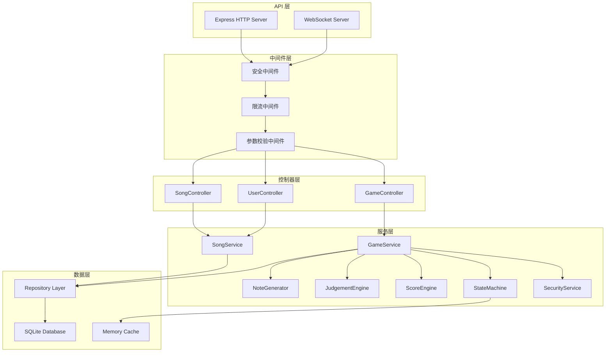
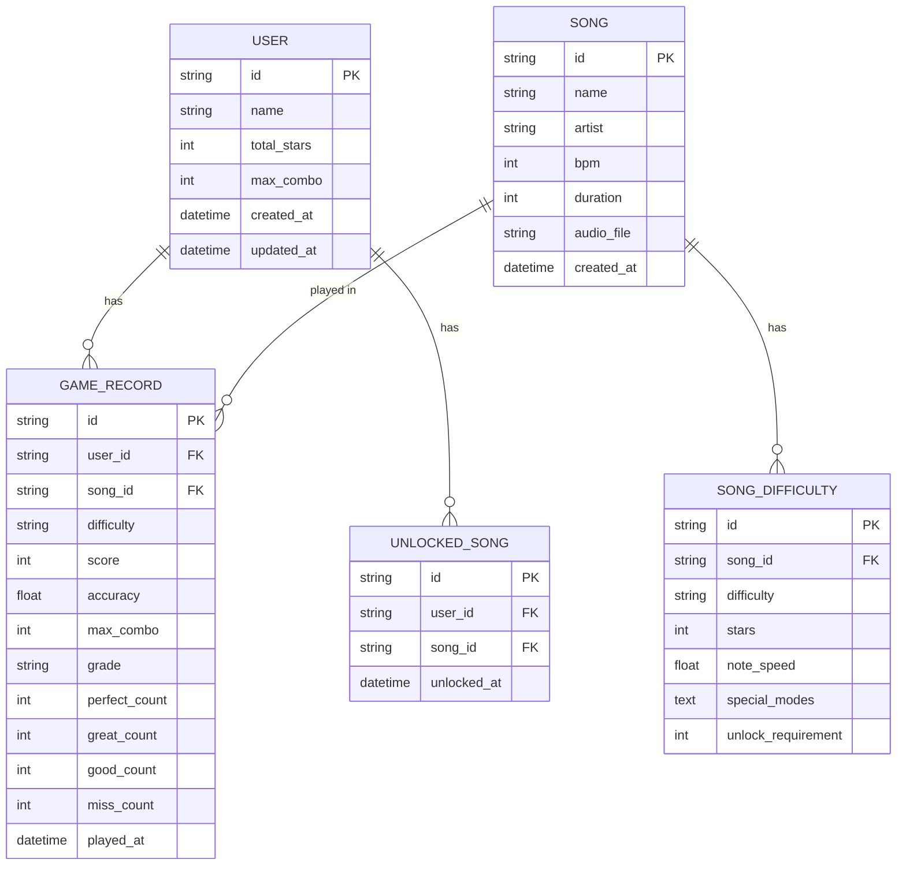

## 1. 架构设计


## 2. 技术描述

- **前端**：React@18 + TypeScript + Vite + TailwindCSS@3 + Zustand
  - 画面渲染：HTML5 Canvas 2D 高性能渲染
  - 触控交互：原生 Touch/Pointer Events，支持多指触控
  - 状态管理：Zustand 管理游戏状态
  - 通信：WebSocket 实时双向通信
  - 本地存储：IndexedDB 持久化游戏进度与记录
- **后端**：Express@4 + TypeScript + WebSocket (ws) + SQLite
  - 服务端口：9654
  - 实时通信：WebSocket 支持对局同步与断线重连
  - 数据库：SQLite 存储关卡配置、用户进度、最高分数
- **前端开发端口**：3654

## 3. 路由定义

| 路由 | 页面/用途 |
|------|----------|
| / | 主页 - 曲目列表与关卡选择 |
| /game/:songId/:difficulty | 游戏对局页 |
| /result/:sessionId | 结算页面 |
| /settings | 设置页面 |

## 4. API 定义

### 4.1 HTTP API

```typescript
// 获取曲目列表
GET /api/songs
Response: {
  songs: Array<{
    id: string;
    name: string;
    artist: string;
    bpm: number;
    duration: number;
    difficulties: Array<{
      level: 'easy' | 'normal' | 'hard' | 'expert';
      stars: number;
      speed: number;
      specialModes?: Array<'speedUp' | 'hidden' | 'shuffle'>;
      unlocked: boolean;
    }>;
    highScore: number;
    highAccuracy: number;
  }>;
}

// 获取用户进度
GET /api/user/progress
Response: {
  userId: string;
  totalStars: number;
  maxCombo: number;
  unlockedSongs: string[];
  highScores: Record<string, number>;
}

// 保存游戏结果
POST /api/game/save
Request: {
  songId: string;
  difficulty: string;
  score: number;
  accuracy: number;
  maxCombo: number;
  grade: 'S' | 'A' | 'B' | 'C' | 'D';
  perfectCount: number;
  greatCount: number;
  goodCount: number;
  missCount: number;
}
Response: {
  success: boolean;
  newHighScore: boolean;
  unlockedSongs?: string[];
}

// 断开重连恢复
POST /api/game/reconnect
Request: { sessionId: string }
Response: {
  gameState: GameState;
  notes: Note[];
  currentTime: number;
}
```

### 4.2 WebSocket 消息协议

```typescript
// 客户端 -> 服务端
type ClientMessage =
  | { type: 'GAME_START'; songId: string; difficulty: string }
  | { type: 'NOTE_HIT'; track: number; timestamp: number; noteId: string }
  | { type: 'GAME_PAUSE' }
  | { type: 'GAME_RESUME' }
  | { type: 'GAME_QUIT' }
  | { type: 'HEARTBEAT'; timestamp: number };

// 服务端 -> 客户端
type ServerMessage =
  | { type: 'GAME_READY'; sessionId: string; notes: Note[]; bpm: number }
  | { type: 'NOTE_SPAWN'; note: Note }
  | { type: 'JUDGEMENT_RESULT'; noteId: string; judgement: Judgement; score: number; combo: number }
  | { type: 'STATE_UPDATE'; state: GameStateUpdate }
  | { type: 'GAME_END'; result: GameResult }
  | { type: 'HEARTBEAT_ACK'; timestamp: number };

// 核心类型
type Judgement = 'perfect' | 'great' | 'good' | 'miss';
type GameStatus = 'idle' | 'playing' | 'paused' | 'ended';

interface Note {
  id: string;
  track: number;
  spawnTime: number;
  hitTime: number;
  type: 'tap' | 'hold' | 'slide';
  duration?: number;
  isHidden?: boolean;
}

interface GameStateUpdate {
  status: GameStatus;
  score: number;
  combo: number;
  maxCombo: number;
  health: number;
  accuracy: number;
  currentTime: number;
}

interface GameResult {
  songId: string;
  score: number;
  accuracy: number;
  maxCombo: number;
  grade: 'S' | 'A' | 'B' | 'C' | 'D';
  perfectCount: number;
  greatCount: number;
  goodCount: number;
  missCount: number;
}
```

## 5. 后端服务架构



## 6. 数据模型

### 6.1 ER 图



### 6.2 DDL 语句

```sql
-- 用户表
CREATE TABLE IF NOT EXISTS users (
    id TEXT PRIMARY KEY,
    name TEXT NOT NULL DEFAULT 'Player',
    total_stars INTEGER NOT NULL DEFAULT 0,
    max_combo INTEGER NOT NULL DEFAULT 0,
    created_at DATETIME DEFAULT CURRENT_TIMESTAMP,
    updated_at DATETIME DEFAULT CURRENT_TIMESTAMP
);

-- 曲目表
CREATE TABLE IF NOT EXISTS songs (
    id TEXT PRIMARY KEY,
    name TEXT NOT NULL,
    artist TEXT NOT NULL,
    bpm INTEGER NOT NULL,
    duration INTEGER NOT NULL,
    audio_file TEXT,
    created_at DATETIME DEFAULT CURRENT_TIMESTAMP
);

-- 曲目难度配置表
CREATE TABLE IF NOT EXISTS song_difficulties (
    id TEXT PRIMARY KEY,
    song_id TEXT NOT NULL REFERENCES songs(id),
    difficulty TEXT NOT NULL CHECK (difficulty IN ('easy', 'normal', 'hard', 'expert')),
    stars INTEGER NOT NULL,
    note_speed REAL NOT NULL DEFAULT 1.0,
    special_modes TEXT,
    unlock_requirement INTEGER NOT NULL DEFAULT 0,
    UNIQUE(song_id, difficulty)
);

-- 游戏记录表
CREATE TABLE IF NOT EXISTS game_records (
    id TEXT PRIMARY KEY,
    user_id TEXT NOT NULL REFERENCES users(id),
    song_id TEXT NOT NULL REFERENCES songs(id),
    difficulty TEXT NOT NULL,
    score INTEGER NOT NULL,
    accuracy REAL NOT NULL,
    max_combo INTEGER NOT NULL,
    grade TEXT NOT NULL CHECK (grade IN ('S', 'A', 'B', 'C', 'D')),
    perfect_count INTEGER NOT NULL DEFAULT 0,
    great_count INTEGER NOT NULL DEFAULT 0,
    good_count INTEGER NOT NULL DEFAULT 0,
    miss_count INTEGER NOT NULL DEFAULT 0,
    played_at DATETIME DEFAULT CURRENT_TIMESTAMP
);

-- 解锁曲目表
CREATE TABLE IF NOT EXISTS unlocked_songs (
    id TEXT PRIMARY KEY,
    user_id TEXT NOT NULL REFERENCES users(id),
    song_id TEXT NOT NULL REFERENCES songs(id),
    unlocked_at DATETIME DEFAULT CURRENT_TIMESTAMP,
    UNIQUE(user_id, song_id)
);

-- 索引
CREATE INDEX IF NOT EXISTS idx_game_records_user_song ON game_records(user_id, song_id);
CREATE INDEX IF NOT EXISTS idx_game_records_score ON game_records(score DESC);
```

### 6.3 初始数据

```sql
-- 插入示例曲目
INSERT OR IGNORE INTO songs (id, name, artist, bpm, duration) VALUES
('song_001', 'Starter Beat', 'Rhythm Master', 120, 60000),
('song_002', 'Neon Pulse', 'Cyber DJ', 140, 90000),
('song_003', 'Digital Dreams', 'Synth Wave', 128, 75000),
('song_004', 'Velocity', 'Speed Runner', 160, 85000),
('song_005', 'Infinity', 'Master Composer', 180, 120000);

-- 插入难度配置
INSERT OR IGNORE INTO song_difficulties (id, song_id, difficulty, stars, note_speed, unlock_requirement) VALUES
('diff_001_1', 'song_001', 'easy', 1, 1.0, 0),
('diff_001_2', 'song_001', 'normal', 2, 1.2, 0),
('diff_001_3', 'song_001', 'hard', 4, 1.5, 3),
('diff_002_1', 'song_002', 'easy', 2, 1.1, 2),
('diff_002_2', 'song_002', 'normal', 3, 1.3, 2),
('diff_002_3', 'song_002', 'hard', 5, 1.6, 5),
('diff_003_1', 'song_003', 'easy', 2, 1.1, 4),
('diff_003_2', 'song_003', 'normal', 4, 1.4, 4),
('diff_003_3', 'song_003', 'hard', 6, 1.7, 8),
('diff_003_4', 'song_003', 'expert', 8, 2.0, 10),
('diff_004_1', 'song_004', 'normal', 5, 1.5, 8),
('diff_004_2', 'song_004', 'hard', 7, 1.8, 12),
('diff_004_3', 'song_004', 'expert', 9, 2.2, 15),
('diff_005_1', 'song_005', 'hard', 8, 2.0, 18),
('diff_005_2', 'song_005', 'expert', 10, 2.5, 25);

-- 创建默认用户
INSERT OR IGNORE INTO users (id, name) VALUES ('default_user', 'Player 1');

-- 解锁初始曲目
INSERT OR IGNORE INTO unlocked_songs (user_id, song_id) VALUES
('default_user', 'song_001'),
('default_user', 'song_002');
```
